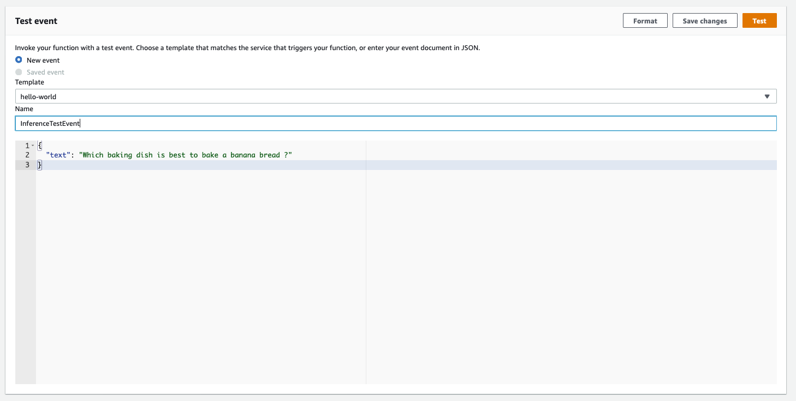
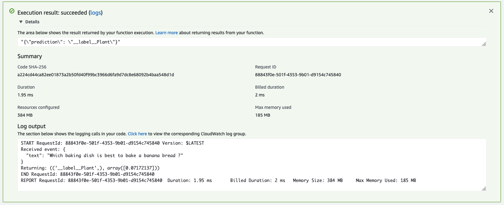

## Train a BlazingText text classification algorithm in SageMaker, inference with AWS Lambda

This example illustrates how to use a BlazingText text classification training with SageMaker, and serving with AWS Lambda.

For both supervised (text classification) and unsupervised (Word2Vec) modes, the binaries (*.bin) produced by BlazingText can be cross-consumed by fastText and vice versa. You can use binaries produced by BlazingText by fastText. Likewise, you can host the model binaries created with fastText using BlazingText.

This project contains source code and supporting files for a serverless application that you can deploy with the notebook. It includes the following files and folders.

- blazingtext-text-classification-train-in-sagemaker-deploy-with-lambda.ipynb - Notebook to run training with SageMaker, and deploy the Lambda function.
- container - The container directory has all the components you need to package the sample Lambda function.
- events - Invocation events that you can use to invoke the function.

## Train a TensorFlow classification model on the MNIST dataset 
You'll be running the [BlazingText text classification training with SageMaker, and serving with AWS Lambda](./blazingtext-text-classification-train-in-sagemaker-deploy-with-lambda.ipynb) notebook to train a TensorFlow classification model on the MNIST dataset.

You can run this notebook in [SageMaker Notebook instance](https://docs.aws.amazon.com/sagemaker/latest/dg/nbi.html) 

**Note: this notebook will not run on SageMaker Studio since you are building a Docker Image.**

This notebooks is identical to the original [BlazingText text classification](https://github.com/aws/amazon-sagemaker-examples/blob/master/introduction_to_amazon_algorithms/blazingtext_text_classification_dbpedia/blazingtext_text_classification_dbpedia.ipynb) notebook, except the fact that you'll deploy the model in Lambda function.

## Testing your Lambda function in the Cloud

1. In the [Lambda Console](https://console.aws.amazon.com/lambda/), select Configure test events from the Test events dropdown.
2. For Event Name, enter InferenceTestEvent.
3. Copy the event JSON from [here](./events/event.json) and paste in the dialog box.
4. Choose _**Create**_.

After saving, you see InferenceTestEvent in the Test list. Now choose _**Test**_.

You see the Lambda function inference result, log output, and duration:

