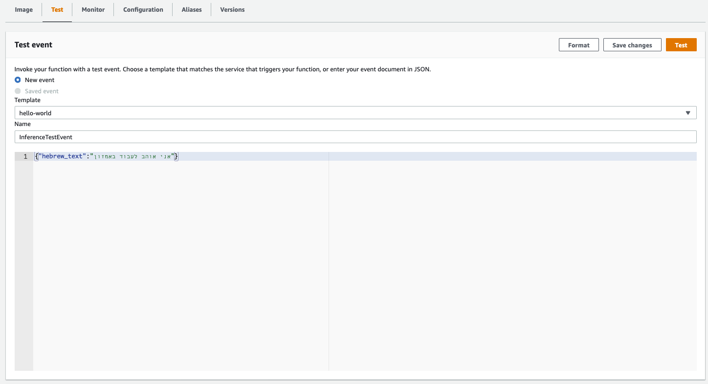
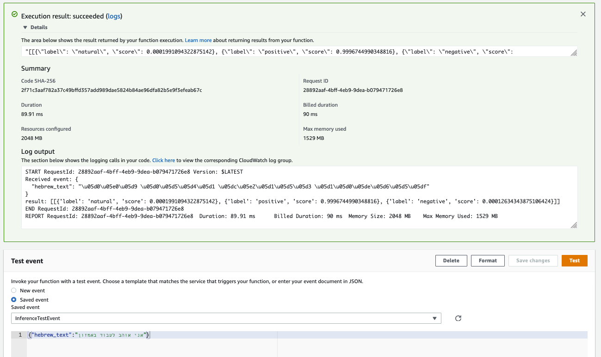

## Serverless HeBERT Model Serving for sentiment analysis in Hebrew

This example illustrates how to serve HeBERT model on Lambda Function for sentiment analysis in Hebrew.

### HeBERT: Pre-trained BERT for Polarity Analysis and Emotion Recognition

Chriqui, A., & Yahav, I. (2021). HeBERT & HebEMO: a Hebrew BERT Model and a Tool for Polarity Analysis and Emotion Recognition. arXiv preprint arXiv:2102.01909.
```
@article{chriqui2021hebert,
  title={HeBERT \& HebEMO: a Hebrew BERT Model and a Tool for Polarity Analysis and Emotion Recognition},
  author={Chriqui, Avihay and Yahav, Inbal},
  journal={arXiv preprint arXiv:2102.01909},
  year={2021}
}
```

This project contains source code and supporting files for a serverless application that you can deploy with the SAM CLI. It includes the following files and folders.

- app - Code for the application's Lambda function.
- model - Code for downloading and saving resnet34 pre-trained model.
- events - Invocation events that you can use to invoke the function.
- template.yaml - A template that defines the application's AWS resources.

The application uses several AWS resources, including Lambda functions. These resources are defined in the `template.yaml` file in this project. You can update the template to add AWS resources through the same deployment process that updates your application code.

## Deploy the sample application

The Serverless Application Model Command Line Interface (SAM CLI) is an extension of the AWS CLI that adds functionality for building and testing Lambda applications. It uses Docker to run your functions in an Amazon Linux environment that matches Lambda. It can also emulate your application's build environment and API.

To use the SAM CLI, you need the following tools.

* SAM CLI - [Install the SAM CLI](https://docs.aws.amazon.com/serverless-application-model/latest/developerguide/serverless-sam-cli-install.html)
* Docker - [Install Docker community edition](https://hub.docker.com/search/?type=edition&offering=community)

You may need the following for local testing.
* [Python 3 installed](https://www.python.org/downloads/)

To build and deploy your application for the first time, run the following in your shell:

```bash
sam build
sam deploy --guided
```

The first command will build a docker image from a Dockerfile and then copy the source of your application inside the Docker image. The second command will package and deploy your application to AWS, with a series of prompts:

* **Stack Name**: The name of the stack to deploy to CloudFormation. This should be unique to your account and region, and a good starting point would be something matching your project name.
* **AWS Region**: The AWS region you want to deploy your app to.
* **Confirm changes before deploy**: If set to yes, any change sets will be shown to you before execution for manual review. If set to no, the AWS SAM CLI will automatically deploy application changes.
* **Allow SAM CLI IAM role creation**: Many AWS SAM templates, including this example, create AWS IAM roles required for the AWS Lambda function(s) included to access AWS services. By default, these are scoped down to minimum required permissions. To deploy an AWS CloudFormation stack which creates or modified IAM roles, the `CAPABILITY_IAM` value for `capabilities` must be provided. If permission isn't provided through this prompt, to deploy this example you must explicitly pass `--capabilities CAPABILITY_IAM` to the `sam deploy` command.
* **Save arguments to samconfig.toml**: If set to yes, your choices will be saved to a configuration file inside the project, so that in the future you can just re-run `sam deploy` without parameters to deploy changes to your application.

## Use the SAM CLI to build and test locally

Build your application with the `sam build` command.

```bash
hebert-sentiment-analysis-inference-docker-lambda$ sam build
```

The SAM CLI builds a docker image from a Dockerfile and then installs dependencies defined in `requirements.txt` inside the docker image. The processed template file is saved in the `.aws-sam/build` folder.

Test a single function by invoking it directly with a test event. An event is a JSON document that represents the input that the function receives from the event source. Test events are included in the `events` folder in this project.

Run functions locally and invoke them with the `sam local invoke` command.

```bash
hebert-sentiment-analysis-inference-docker-lambda$ sam local invoke HeBERTInferenceFunction --event events/event.json
```
## Testing your Lambda function in the Cloud

1. In the [Lambda Console](https://console.aws.amazon.com/lambda/), select your Lambda function, then, the `Test` tab, and configure the Test event.
2. For Event Name, enter InferenceTestEvent.
3. Copy the event JSON from [here](./events/event.json) and paste in the dialog box.
4. Choose _**Test**_.



After saving, you see InferenceTestEvent in the Test list. Now choose _**Test**_.

You see the Lambda function inference result, log output, and duration:



## Fetch, tail, and filter Lambda function logs

To simplify troubleshooting, SAM CLI has a command called `sam logs`. `sam logs` lets you fetch logs generated by your deployed Lambda function from the command line. In addition to printing the logs on the terminal, this command has several nifty features to help you quickly find the bug.

`NOTE`: This command works for all AWS Lambda functions; not just the ones you deploy using SAM.

```bash
hebert-sentiment-analysis-inference-docker-lambda$ sam logs -n HeBERTInferenceFunction --stack-name hebert-sentiment-analysis-inference-docker-lambda --tail
```

You can find more information and examples about filtering Lambda function logs in the [SAM CLI Documentation](https://docs.aws.amazon.com/serverless-application-model/latest/developerguide/serverless-sam-cli-logging.html).


## Cleanup

To delete the sample application that you created, use the AWS CLI. Assuming you used your project name for the stack name, you can run the following:

```bash
aws cloudformation delete-stack --stack-name hebert-sentiment-analysis-inference-docker-lambda
```

## Resources

See the [AWS SAM developer guide](https://docs.aws.amazon.com/serverless-application-model/latest/developerguide/what-is-sam.html) for an introduction to SAM specification, the SAM CLI, and serverless application concepts.
