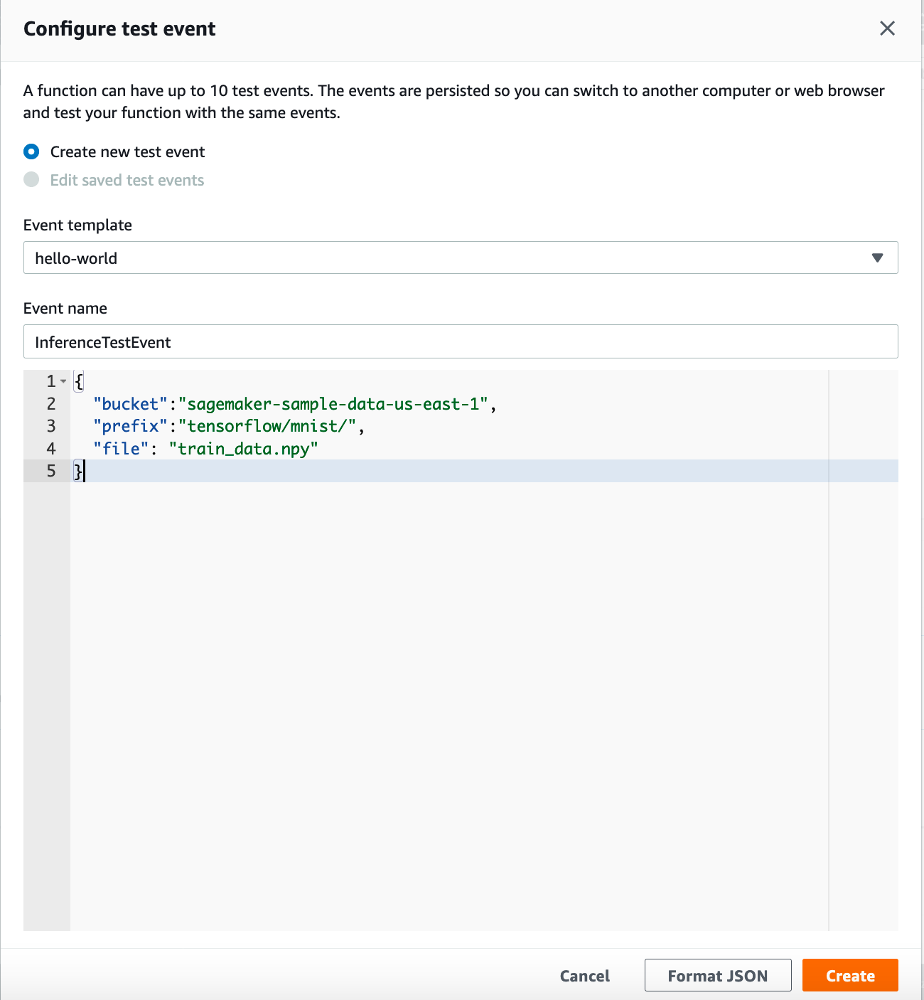
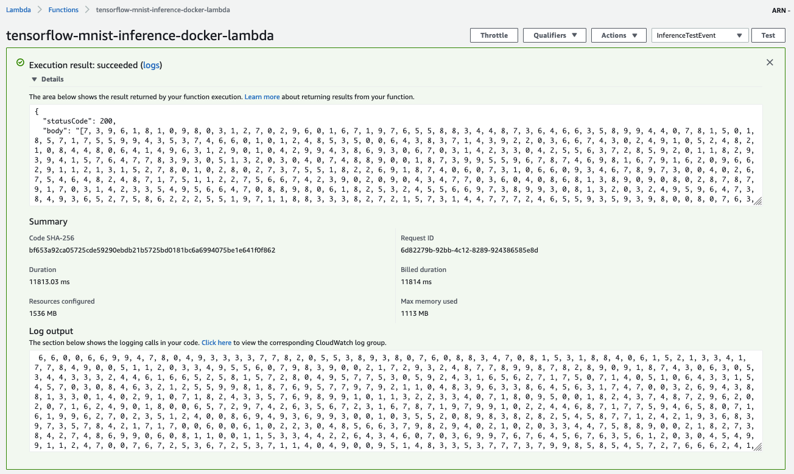

## Train a TensorFlow algorithm in SageMaker, inference with AWS Lambda

This examples illustrates how to use a TensorFlow Python script to train a classification model on the MNIST dataset. You train the model using SageMaker and inference with AWS Lambda.

This project contains source code and supporting files for a serverless application that you can deploy with the notebook. It includes the following files and folders.

- tensorflow_script_mode_training_in_sagemaker_and_serving_with_lambda.ipynb - Notebook to run training with SageMaker, and deploy the Lambda function.
- container - The container directory has all the components you need to package the sample Lambda function.
- events - Invocation events that you can use to invoke the function.

## Train a TensorFlow classification model on the MNIST dataset 
You'll be running the [TensorFlow script mode training with SageMaker, and serving with AWS Lambda](./tensorflow_script_mode_training_in_sagemaker_and_serving_with_lambda.ipynb) notebook to train a TensorFlow classification model on the MNIST dataset.

You can run this notebook in [SageMaker Notebook instance](https://docs.aws.amazon.com/sagemaker/latest/dg/nbi.html)

This notebooks is identical to the original [TensorFlow script mode training and serving](https://github.com/aws/amazon-sagemaker-examples/blob/master/sagemaker-python-sdk/tensorflow_script_mode_training_and_serving/tensorflow_script_mode_training_and_serving.ipynb) notebook, except the fact that you'll deploy the model in Lambda function.

## Testing your Lambda function in the Cloud

1. In the [Lambda Console](https://console.aws.amazon.com/lambda/), select Configure test events from the Test events dropdown.
2. For Event Name, enter InferenceTestEvent.
3. Copy the event JSON from [here](./events/event.json) and paste in the dialog box.
4. Choose _**Create**_.

After saving, you see InferenceTestEvent in the Test list. Now choose _**Test**_.

You see the Lambda function inference result, log output, and duration:

